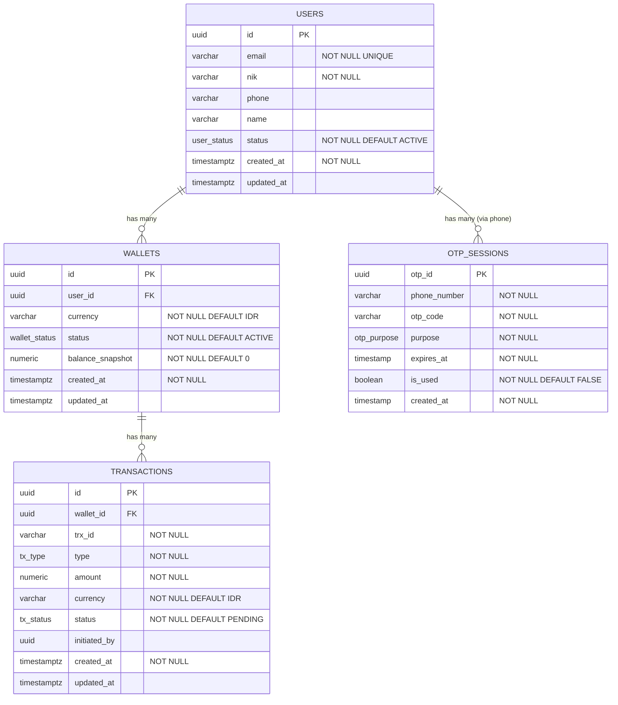

## Kebutuhan 1 : user bisa login

### Post /auth/login

Request Body:
```json
{
    "email" : "0812345678",
    "Password" : "admin"
}

```


Response Body :
```json
{
    "status": "success",
    "error" :{
        "reason" : ""
        }
}
```

## Kebutuhan 2 : User bisa register sebagai new user
### Post /register
Request Body:
```json
{
    "email" : "naufal.sunandar@bni.co.id",
    "name" : "naufal sunandar",
    "Password" : "admin",
    "nik" : "666666667777771",
    "phone" : "0812345678",
    "created_at" : 1759808188
    
}
```


Response Body :
```json
{
    "status": "success",
    "error" :{
        "reason" : ""
        }
}
```


## Kebutuhan 3 : User bisa ganti password
### Post /request_change_password
Request Body:
```json
{
    "email" : "naufal.sunandar@bni.co.id"
}
```

### Post /change_password
Request Body:
```json
{
    "otp" : 123456,
    "email" : "naufal.sunandar@bni.co.id",
    "password" : "admin"
}
```

Response Body :
```json
{
    "status": "success",
    "error" :{
        "reason" : ""
        }
}
```


## Kebutuhan 4 : User bisa logout
### Post /logout
Request Body:
```json
{
    
}
```

Response Body :
```json
{
    "status": "success",
    "error" :{
        "reason" : ""
        }
}
```

## Kebutuhan 5 : User bisa melakukan inquiry
### Post /inquiry
Request Body:
```json
{
  "phone": "0812345678"
}
```

Response Body :
```json
{

    "name" : "kai riven",
    "uuid" : 1,
    "status": "success",
    "error" :{
        "reason" : ""
        }
}
```


## Kebutuhan 6 : User bisa transfer
### Post /transfer
Request Body:
```json
{
  "to_uuid": 1,
  "amount": 100000,
  "currency": "IDR",
  "note": "bayar makan siang"
}
```

Response Body :
```json
{
    "status": "success",
    "error" :{
        "reason" : ""
        }
}
```


## Kebutuhan 6 : User bisa baca riwayat history
### Post /check_transfer_history
Request Body:
```json
{

}
```

Response Body :
```json
{
  "status":"success",
  "error" :{
        "reason" : ""
        },
  "data": {
    "transactions": [ ],
    "pagination": { "page":1, "page_size":20, "total_pages": 10, "total_items": 200 }
  }
}
```

## Kebutuhan 8 : User bisa top pup
### Post /toppup
Request Body:
```json
{
  "topup_amount" :100000,
  "currency" : "IDR"
}
```

Response Body :
```json
{
  "status":"success",
  "error" :{
        "reason" : ""
        }
}
```


## Kebutuhan 13 : User bisa ganti data user
### Post /update_data
Request Body:
```json
{
    "email" : "naufal.sunandar@bni.co.id",
    "name" : "naufal sunandar",
    "Password" : "admin",
    "nik" : "666666667777771",
    "phone" : "0812345678",
    "updated_at" : 1759808188
    
}
```


Response Body :
```json
{
    "status": "success",
    "error" :{
        "reason" : ""
        }
}
```

## Kebutuhan 14 : User bisa melihat saldo
### Get /user/balance
Request Body:
```json

```


Response Body :
```json
{
  "balance" : 100000,
  "last-update" : 1759813097,
    "status": "success",
    "error" :{
        "reason" : ""
        }
}
```

## Kebutuhan 14 : User bisa data profile
### Get /user/profile
Request Body:
```json
{
  
}
```

Response Body :
```json
{
  "email" : "naufal.sunandar@bni.co.id",
  "name" : "naufal sunandar",
  "Password" : "admin",
  "nik" : "666666667777771",
  "phone" : "0812345678"

}
```

## ERD



# 🚀 GitHub Workflow Guide

Dokumentasi ini menjelaskan alur kerja dasar dalam proyek ini menggunakan GitHub. Workflow ini dirancang untuk menjaga kualitas kode, memudahkan kolaborasi, dan mendukung integrasi dengan CI/CD.

    A[Start] --> B[Clone Repository]: git clone https://github.com/username/repo-name.git
    B --> C[Create New Branch]: git checkout -b (nama branch)
    C --> D[Make Changes to Code]
    D --> E[Stage Changes (git add)]: git add (masukkan file yang diberikan perubahan)
    E --> F[Commit Changes (git commit)]: git commit -m "Keterangan"
    F --> G[Push Branch to GitHub]: git push origin (branch)
    G --> H[Create Pull Request]: Klik "Compare & Pull Request" (Repository di Github)
    H --> I[Code Review & Discussion]
    I --> J[Merge to Main Branch]: Klik "Merge pull request"
    J --> K[Delete Feature Branch (optional)]
    K --> L[End]

