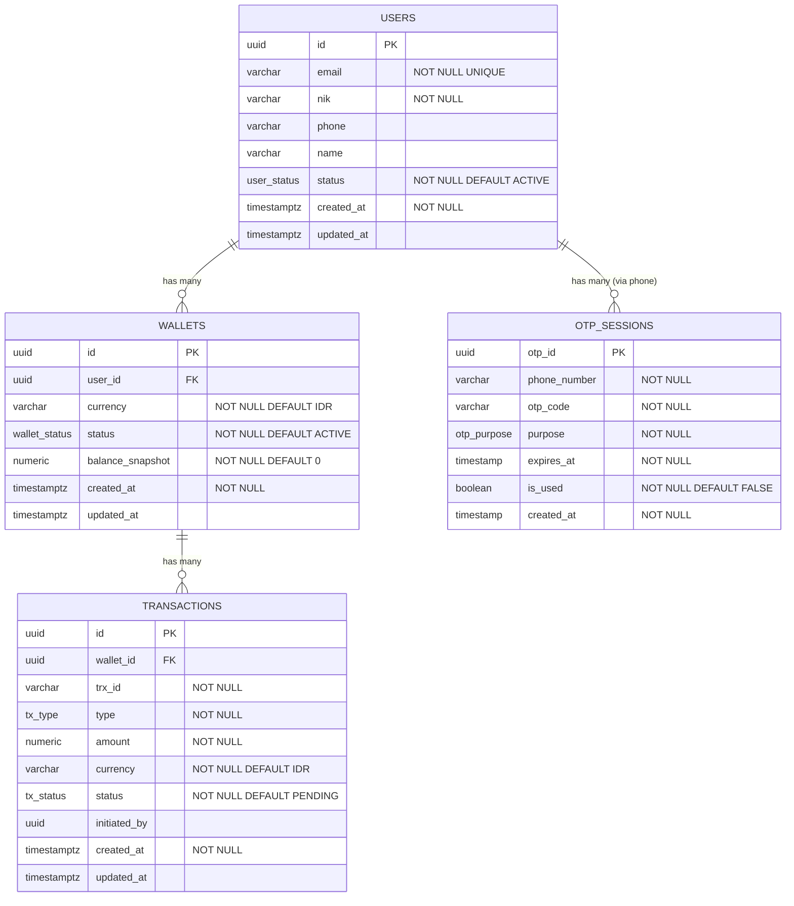

## Kebutuhan 1 : user bisa login

### Post /auth/login
Request Body 1 - email:
```
{
    "login_method" : 1
    "email" : "naufal.sunandar@bni.co.id",
    "Password" : "admin"
}
```


Request Body 2 - email:
```
{
    "login_method" : 2
    "email" : "0812345678",
    "Password" : "admin"
}

```


Response Body :
```
{
    "status": "success",
    "error" :{
        "reason" : ""
        }
}
```

## Kebutuhan 2 : User bisa register sebagai new user
### Post /register
Request Body:
```
{
    "email" : "naufal.sunandar@bni.co.id",
    "name" : "naufal sunandar",
    "Password" : "admin",
    "nik" : "666666667777771",
    "phone" : "0812345678",
    "created_at" :  
    
}
```


Response Body :
```
{
    "status": "success",
    "error" :{
        "reason" : ""
        }
}
```


## Kebutuhan 3 : User bisa ganti password
### Post /request_change_password
Request Body:
```
{
    "email" : "naufal.sunandar@bni.co.id"
}
```

### Post /change_password
Request Body:
```
{
    "otp" : 123456,
    "email" : "naufal.sunandar@bni.co.id"
    "password" : "admin"
}
```

Response Body :
```
{
    "status": "success",
    "error" :{
        "reason" : ""
        }
}
```


## Kebutuhan 4 : User bisa logout
### Post /logout
Request Body:
```
{
    
}
```

Response Body :
```
{
    "status": "success",
    "error" :{
        "reason" : ""
        }
}
```

## Kebutuhan 5 : User bisa melakukan inquiry
### Post /inquiry
Request Body:
```
{
  "phone": "0812345678"
}
```

Response Body :
```
{

    "name" : "kai riven",
    "uuid" : 1,
    "status": "success",
    "error" :{
        "reason" : ""
        }
}
```


## Kebutuhan 6 : User bisa transfer
### Post /transfer
Request Body:
```
{
  "to_uuid": 1,
  "amount": 100000,
  "currency": "IDR",
  "note": "bayar makan siang"
}
```

Response Body :
```
{
    "status": "success",
    "error" :{
        "reason" : ""
        }
}
```


## Kebutuhan 6 : User bisa baca riwayat history
### Post /check_transfer_history
Request Body:
```
{

}
```

Response Body :
```
{
  "status":"success",
  "error" :{
        "reason" : ""
        }
  "data": {
    "transactions": [ /* Transaction[] */ ],
    "pagination": { "page":1, "page_size":20, "total_pages": 10, "total_items": 200 }
  }
}
```


ERD




