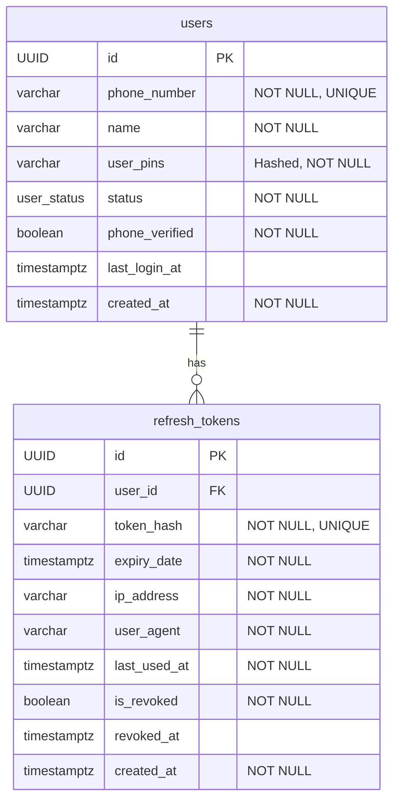

# BNI Orange E-Wallet - Backend Services

Proyek ini berisi layanan backend untuk aplikasi E-Wallet, dibangun dengan arsitektur microservices menggunakan Spring Boot.

## Arsitektur Microservices

Sistem ini terdiri dari beberapa layanan independen yang berkomunikasi satu sama lain. API Gateway bertindak sebagai pintu masuk tunggal untuk semua permintaan dari klien.

| Service                  | Port | Deskripsi                                                              |
| ------------------------ | ---- | ---------------------------------------------------------------------- |
| **API Gateway**          | 8080 | Merutekan permintaan, menangani keamanan, dan CORS.                    |
| **Authentication Service** | 8081 | Mengelola otentikasi pengguna, onboarding, token, dan manajemen PIN. |
| **User Service**         | 8082 | Mengelola data profil pengguna.                                        |
| **Transaction Service**  | 8083 | Menangani logika transfer dan riwayat transaksi.                       |
| **Top-up Service**       | 8084 | Mengelola proses top-up saldo.                                         |
| **Wallet Service**       | -    | Mengelola saldo dan dompet pengguna.                                   |

---

## 1. API Gateway

API Gateway adalah gerbang utama untuk semua interaksi klien dengan sistem backend. Dibangun menggunakan Spring Cloud Gateway, layanan ini bertanggung jawab untuk:

-   **Routing:** Meneruskan permintaan masuk ke layanan mikro yang sesuai.
-   **Security:** Memvalidasi token otentikasi (JWT) pada setiap permintaan yang dilindungi.
-   **Cross-Cutting Concerns:** Mengelola CORS dan memfilter token yang telah di-blacklist (misalnya, setelah logout).

### Teknologi

-   Java 21
-   Spring Boot 3
-   Spring Cloud Gateway
-   Spring Security (OAuth2 Resource Server)
-   Project Reactor (WebFlux)
-   Redis (untuk blacklisting token)
-   Gradle

### Konfigurasi Routing

Semua permintaan dirutekan berdasarkan path prefix ke layanan backend yang relevan.

| Path Prefix                                                      | Target Service             | Target URL                  |
| ---------------------------------------------------------------- | -------------------------- | --------------------------- |
| `/api/v1/auth/**`, `/api/v1/pin/**`, `/api/v1/sessions/**`, `/oauth2/jwks` | `authentication-service`   | `http://localhost:8081`     |
| `/api/v1/user/**`                                                | `user-service`             | `http://localhost:8082`     |
| `/api/v1/transaction/**`                                         | `transaction-service`      | `http://localhost:8083`     |
| `/api/v1/topup/**`                                               | `topup-service`            | `http://localhost:8084`     |

### Keamanan (Security)

-   **Otentikasi:** Gateway bertindak sebagai **OAuth2 Resource Server**. Setiap permintaan ke endpoint yang dilindungi harus menyertakan `Authorization: Bearer <JWT>` header.
-   **Endpoint Publik:** Endpoint untuk otentikasi (`/api/v1/auth/**`) dan JWKS (`/oauth2/jwks`) dapat diakses secara publik.
-   **Endpoint Terproteksi:** Semua endpoint lain memerlukan token JWT yang valid.
-   **Validasi Token:** Gateway memvalidasi tanda tangan (signature) JWT dengan mengambil kunci publik dari `authentication-service` melalui endpoint `http://localhost:8081/oauth2/jwks`.
-   **Token Blacklisting:** Ketika pengguna logout, JTI (JWT ID) dari token mereka ditambahkan ke daftar hitam (blacklist) di Redis. `JwtBlacklistGatewayFilter` memastikan bahwa token yang sudah di-blacklist tidak dapat digunakan kembali.

### Menjalankan Service

#### Menggunakan Gradle

```bash
# Masuk ke direktori api-gateway
cd api-gateway

# Jalankan service
./gradlew bootRun
```

#### Menggunakan Docker

Pastikan Docker sudah terinstall dan berjalan.

```bash
# Masuk ke direktori api-gateway
cd api-gateway

# 1. Build Docker image
docker build -t bni-orange/api-gateway .

# 2. Jalankan container
docker run -p 8080:8080 \
  -e REDIS_HOST=host.docker.internal \
  -e REDIS_PORT=6379 \
  --name api-gateway-container \
  bni-orange/api-gateway
```

> **Catatan:** `-e REDIS_HOST=host.docker.internal` digunakan untuk menghubungkan container ke Redis yang berjalan di mesin host Anda. Sesuaikan jika Redis berjalan di tempat lain.

### Konfigurasi Environment

Service ini memerlukan konfigurasi environment variables berikut:

| Variabel      | Deskripsi                  | Default Value |
| ------------- | -------------------------- | ------------- |
| `REDIS_HOST`  | Hostname dari Redis server | `localhost`   |
| `REDIS_PORT`  | Port dari Redis server     | `6379`        |

---

## 2. Authentication Service

Layanan pusat untuk semua hal yang berkaitan dengan identitas dan keamanan pengguna.

### Tanggung Jawab Utama
- **User Onboarding**: Registrasi pengguna baru melalui verifikasi nomor telepon (OTP).
- **Authentication**: Proses login passwordless menggunakan OTP dan PIN.
- **Token Generation**: Membuat dan mengelola siklus hidup JWT (Access Token, Refresh Token, State Token).
- **PIN Management**: Mengatur, mengubah, dan mereset PIN pengguna secara aman.
- **Session Management**: Memungkinkan pengguna melihat dan mengelola sesi aktif mereka.
- **Security Enforcement**: Melindungi dari serangan brute-force dan menyediakan mekanisme keamanan token.
- **Event Publishing**: Menerbitkan event penting (seperti registrasi pengguna) ke Apache Kafka.

### Teknologi
- Java 21 (+ Virtual Threads)
- Spring Boot 3
- Spring Security (OAuth2 Authorization Server)
- Spring Data JPA (Hibernate)
- PostgreSQL (via Flyway untuk migrasi)
- Redis (untuk OTP, rate limiting, session state)
- Apache Kafka (untuk arsitektur event-driven)
- Protobuf (untuk serialisasi event Kafka)
- Gradle

### Skema Database (ERD)

Diagram berikut menggambarkan entitas utama dalam skema `auth_oltp`.



### Spesifikasi API

Dokumentasi lengkap API tersedia dalam bentuk [Postman Collection](./authentication-service/postman-collection.json).

#### 1. User Onboarding & Login

##### **1.1 Request OTP**
- **Endpoint**: `POST /api/v1/auth/request`
- **Deskripsi**: Memulai alur login atau registrasi dengan mengirimkan OTP ke nomor telepon pengguna. Jika nomor belum terdaftar, user baru akan dibuat dengan status `PENDING_VERIFICATION`.
- **Authorization**: Publik
- **Request Body**:
  ```json
  {
    "phoneNumber": "081234567890"
  }
  ```
- **Success Response (200 OK)**:
  ```json
  {
    "message": "OTP has been sent to your WhatsApp"
  }
  ```
- **Error Response (429 Too Many Requests)**:
  ```json
  {
    "error": {
      "code": "AUTH-2001",
      "message": "Please wait before requesting another OTP."
    }
  }
  ```

##### **1.2 Verify OTP**
- **Endpoint**: `POST /api/v1/auth/verify`
- **Deskripsi**: Memverifikasi OTP yang diterima pengguna. Jika berhasil, mengembalikan `stateToken` yang diperlukan untuk langkah selanjutnya (mengatur atau memasukkan PIN).
- **Authorization**: Publik
- **Request Body**:
  ```json
  {
    "phoneNumber": "081234567890",
    "otp": "123456"
  }
  ```
- **Success Response (200 OK)**:
  - Scope `PIN_SETUP` untuk pengguna baru.
  - Scope `PIN_LOGIN` untuk pengguna yang sudah ada.
  ```json
  {
    "stateToken": "ey...",
    "expiresIn": 300
  }
  ```
- **Error Response (400 Bad Request)**:
  ```json
  {
    "error": {
      "code": "AUTH-2002",
      "message": "The provided OTP is invalid or has expired."
    }
  }
  ```

##### **1.3 Authenticate with PIN**
- **Endpoint**: `POST /api/v1/auth/pin`
- **Deskripsi**: Mengatur PIN untuk pengguna baru atau melakukan login untuk pengguna yang sudah ada.
- **Authorization**: `Bearer <stateToken>` dengan scope `PIN_SETUP` atau `PIN_LOGIN`.
- **Request Body**:
  ```json
  {
    "pin": "123456"
  }
  ```
- **Success Response (200 OK)**:
  ```json
  {
    "accessToken": "ey...",
    "refreshToken": "...",
    "expiresIn": 900
  }
  ```
- **Error Response (401 Unauthorized)**:
  ```json
  {
    "error": {
      "code": "AUTH-3002",
      "message": "The provided PIN is incorrect."
    }
  }
  ```

#### 2. Manajemen Token

##### **2.1 Refresh Token**
- **Endpoint**: `POST /api/v1/auth/refresh`
- **Deskripsi**: Menerbitkan `accessToken` dan `refreshToken` baru. Refresh token yang lama akan dicabut (Token Rotation).
- **Authorization**: Publik
- **Request Body**:
  ```json
  {
    "refreshToken": "..."
  }
  ```
- **Success Response (200 OK)**:
  ```json
  {
    "accessToken": "ey...",
    "refreshToken": "...",
    "expiresIn": 900
  }
  ```
- **Error Response (401 Unauthorized)**:
  - `AUTH-4002`: Refresh token kedaluwarsa.
  - `AUTH-4003`: Penggunaan kembali token terdeteksi (semua sesi dihentikan).

##### **2.2 Logout**
- **Endpoint**: `POST /api/v1/auth/logout`
- **Deskripsi**: Mencabut token yang sedang digunakan. `accessToken` akan dimasukkan ke blacklist Redis dan `refreshToken` akan dihapus dari database.
- **Authorization**: `Bearer <accessToken>` dengan scope `FULL_ACCESS`.
- **Request Body**:
  ```json
  {
    "refreshToken": "..."
  }
  ```
- **Success Response (200 OK)**:
  ```json
  {
    "message": "Successfully logged out"
  }
  ```

#### 3. Manajemen PIN

##### **3.1 Change PIN**
- **Endpoint**: `POST /api/v1/pin/change`
- **Deskripsi**: Mengubah PIN pengguna. Memerlukan PIN lama. Semua sesi lain akan di-logout setelah berhasil.
- **Authorization**: `Bearer <accessToken>` dengan scope `FULL_ACCESS`.
- **Request Body**:
  ```json
  {
    "currentPin": "123456",
    "newPin": "654321"
  }
  ```
- **Success Response (200 OK)**:
  ```json
  {
    "message": "PIN has been successfully changed. All other sessions have been logged out."
  }
  ```

##### **3.2 Reset PIN (Forgot PIN)**
- **Alur**: `POST /reset/request` -> `POST /reset/verify` -> `POST /reset/confirm`
- **Deskripsi**: Alur 3 langkah untuk mereset PIN menggunakan verifikasi OTP.
- **Authorization**:
  - `/request` & `/verify`: Publik
  - `/confirm`: `Bearer <stateToken>` dengan scope `PIN_RESET`.
- **Request Body (`/reset/confirm`)**:
  ```json
  {
    "newPin": "112233"
  }
  ```
- **Success Response (`/reset/confirm`, 200 OK)**:
  ```json
  {
    "message": "PIN has been successfully reset."
  }
  ```

#### 4. Manajemen Sesi

##### **4.1 Get Active Sessions**
- **Endpoint**: `GET /api/v1/sessions`
- **Deskripsi**: Mendapatkan daftar semua sesi aktif untuk pengguna.
- **Authorization**: `Bearer <accessToken>` dengan scope `FULL_ACCESS`.
- **Headers**:
  - `X-Refresh-Token`: `...` (Refresh token dari sesi saat ini).
- **Success Response (200 OK)**:
  ```json
  [
    {
      "sessionId": "uuid-...",
      "ipAddress": "127.0.0.1",
      "userAgent": "PostmanRuntime/7.37.3",
      "lastUsedAt": "2025-10-12T12:00:00Z",
      "isCurrent": true
    }
  ]
  ```

##### **4.2 Terminate Session**
- **Endpoint**: `DELETE /api/v1/sessions/{sessionId}`
- **Deskripsi**: Menghentikan (logout) sesi tertentu dari jarak jauh.
- **Authorization**: `Bearer <accessToken>` dengan scope `FULL_ACCESS`.
- **Success Response (200 OK)**: (No body content)

### Menjalankan Service

#### Menggunakan Gradle
```bash
# Masuk ke direktori authentication-service
cd authentication-service

# Jalankan service
./gradlew bootRun
```

### Konfigurasi Environment
| Variabel                  | Deskripsi                               | Default Value                       |
| ------------------------- | --------------------------------------- | ----------------------------------- |
| `DB_URL`                  | URL koneksi database PostgreSQL         | `jdbc:postgresql://localhost:5432/orange_db` |
| `DB_USERNAME`             | Username database                       | `mikasa`                            |
| `DB_PASSWORD`             | Password database                       | `mikasa`                            |
| `REDIS_HOST`              | Hostname dari Redis server              | `localhost`                         |
| `REDIS_PORT`              | Port dari Redis server                  | `6379`                              |
| `KAFKA_BOOTSTRAP_SERVERS` | Alamat broker Kafka                     | `localhost:9092`                    |